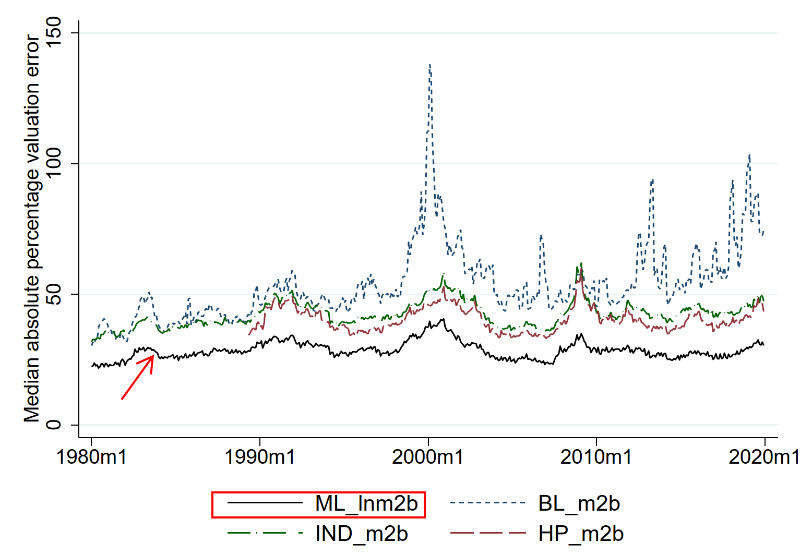

# Relative Valuation With Machine Learning

Code for the paper "Relative Valuation with Machine Learning", Geertsema and Lu (2022)

## Paper reference
Geertsema and Lu (2022), "Relative Valuation with Machine Learning", SSRN, https://papers.ssrn.com/sol3/papers.cfm?abstract_id=3740270

## TL;DR

Machine learning outperforms traditional approaches in the context of automated equity valuation using fundamental accounting data. **ML_lnm2b** is the performance of our model using LightGBM. The other models are from the prior literature. See Figure 1(A) in the paper.

## Abstract

We use machine learning for relative valuation and peer firm selection. In out-of-sample tests our machine learning models substantially outperform traditional models in valuation accuracy. This outperformance persists over time and holds across different types of firms. The valuations produced by machine learning models behave like fundamental values. Over-valued stocks decrease in price and under-valued stocks increase in price in the following month. Determinants of valuation multiples identified by machine learning models are consistent with theoretical predictions derived from a discounted cash flow approach. Profitability ratios, growth measures and efficiency ratios are the most important value drivers throughout our sample period. We derive a novel method to express valuation multiples predicted by our machine learning models as weighted averages of peer firm multiples. These weights are a measure of peer-firm comparability and can be used for selecting peer-groups.

## Computational Requirements

**Hardware**

You will need a reasonably specced machine. We tested the code on a machine with 64GB of RAM and ample (>400GB) free space on an SSD. Expect a runtime of 12-24 hours.

**Software**

Stata MP version 17 or higher

Python 3.10.4

**Python packages**

See requirements.txt in [MLCode](MLCode) folder

## Suggested background

You will need to be comfortable in Stata and Python, and familiar with machine learning (especially LightGBM and SHAP), experienced working with Compustat and CRSP data, have a reasonable background in accounting/finance/economics and some basic linear algebra. Or you should be a team that covers all these bases.

## Source data for running the code

See [source](source) for source data we can share.

We use Compustat annual and quarterly for accounting data, CRSP for market data and SDC platinum for IPO data. This is proprietary data we can't share, so you will need to bring your own.

### Not supplied:

crsp_daily.dta -- CRSP daily file in Stata format

compustatq.dta -- Compustat quarterly file in Stata format

Compustat.dta -- Compustat annual file in Stata format

crsp_msf_processed.dta -- CRSP monthly file in Stata format. [1]

factorloadings_crspmonthly.dta -- Monthly factor loadings. [2]

SDC_19_7_2019_cleaned_long.xlsx -- IPO data from SDC platinum

gvkeypermno.dta -- Link table to match gvkeys (Compustat) to permnos (CRSP) from WRDS

[1]: Processed to eliminate duplicate permno mth observations and create variable "r" equal to next month CRSP delisting adjusted excess return, and variable "daret" equal to desisting adjusted total return in the current month.

[2]: We only use variable "CAPMbeta", which is the beta on the market factor (FF MKTRF) estimated in monthly data over 60 month rolling windows.

### Supplied data:

See [Source](source).

anomalystrategies_clusters.dta [3]

nysebreaks.dta -- NYSE breakpoints 

Ritter_IPO_andage19752019.xlsx -- List of IPO's from Jay Ritter. https://site.warrington.ufl.edu/ritter/ipo-data/

SCOOP-Rating-Performance.xls -- IPO list from IPOScoop. https://www.iposcoop.com/

tnic3_data.txt [4]

ff12_sic.dta -- Fama/French 12 industry classifications

sic2ff49map.dta -- Fama/French 49 industry map to 2-digit SIC codes

ff49_2_ff49_desc.dta -- Fama/French 49 industry descriptions

[3]: From "The correlation structure of anomaly strategies", Journal of Banking and Finance, Geertsema and Lu (2021). See https://papers.ssrn.com/sol3/papers.cfm?abstract_id=3002797

[4]: Hoberg and Philips industry classifications (TNIC 3). https://hobergphillips.tuck.dartmouth.edu/industryclass.htm

## Steps

### Clone this repo to your local drive

### Create local folders

In addition to Stata (for Stata code), MLcode (for Python code) and Source (data files we can share), you will need to create

work -- a folder for intermediate calculations (will have > 100,000 files when processing is complete)

results -- a folder containing graphs (in pdf format) and tables (in latex format) for inclusion in the final paper. See 999TablesAndFiguresList.do in Stata directory for a list of which files are associated with which tables / figures in the paper.

### Modify 000RunAll.do 

Modify global macro definitions in lines 42-66 in 000RunAll.do in the [Stata](stata) folder to point at your own local folders and Python environment as appropriate.
The Stata code assumes that you have an anaconda installation with a environment called "Valuation" that contains the relevant Python packages. Modify as needed.

### Execute 000RunAll.do

Within Stata execute 000RunAll.do. Come back in a day or so. The Stata code automatically invokes the Python interpreter to run the Python code.

## Troubleshooting

The code as provided ran from start to finish on our machine. However, it is unlikely that the code will "just run" without any errors in a different environment with different data; do be prepared to troubleshoot. That said, any fixes should be reasonably straight-forward.

If you do get errors running the code, the following are possible causes.

1. Missing data files and/or incorrectly specified folders.
2. Missing Stata ado files. If this is the case, install the missing ado file (an ado file in Stata is like a Python package) using "findit <package name>"
3. Insuficient memory or disk space. (See requirements above. This should not be an issue with 64GB+ memory and 400GB+ free disk space.
  
If you are an academic researcher who is seeking to replicate our work as part of a replicaton study, feel free to get in touch for assistence. We regret that we are unable to provide unpaid assistence otherwise.
  
